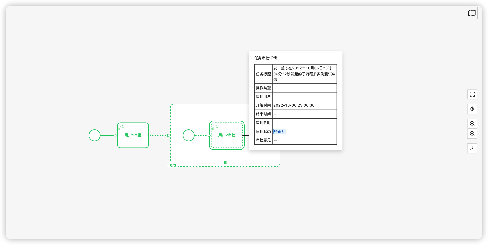

Skill Full Process Demo
===============
bpmn designer ,bpmn instance ,skill-cloud

当前最新版本： 1.2.3（发布日期：2022-10-11）

# 注意事项：
## 一、 安装依赖
```
yarn add skillfull-process-pro-antvue bpmn-js-properties-panel
```
## 二、SkillFullBpmnDesigner需要引入一下css样式
```
  @import 'skillfull-process-pro-antvue/dist/style.css';
  @import 'bpmn-js-color-picker/colors/color-picker.css';
  @import 'bpmn-js/dist/assets/bpmn-font/css/bpmn.css';
  @import 'bpmn-js/dist/assets/bpmn-font/css/bpmn-codes.css';
  @import 'bpmn-js/dist/assets/bpmn-font/css/bpmn-embedded.css';
  @import 'bpmn-js/dist/assets/bpmn-js.css';
  @import 'bpmn-js/dist/assets/diagram-js.css';
  @import 'bpmn-js-properties-panel/dist/assets/properties-panel.css';
  @import 'bpmn-js-token-simulation/assets/css/bpmn-js-token-simulation.css';
  @import 'diagram-js-minimap/assets/diagram-js-minimap.css';
  @import 'bpmn-js-bpmnlint/dist/assets/css/bpmn-js-bpmnlint.css';
```

## 三、SkillFullBpmnDiffer需要引入一下css样式
```
  @import 'skillfull-process-pro-antvue/dist/style.css';
  @import 'bpmn-js/dist/assets/diagram-js.css';
  @import 'bpmn-js/dist/assets/bpmn-js.css';
```

## 四、SkillFullBpmnPreview需要引入一下css样式
```
  @import 'skillfull-process-pro-antvue/dist/style.css';
  @import 'bpmn-js/dist/assets/bpmn-font/css/bpmn.css';
  @import 'bpmn-js/dist/assets/bpmn-font/css/bpmn-codes.css';
  @import 'bpmn-js/dist/assets/bpmn-font/css/bpmn-embedded.css';
  @import 'bpmn-js/dist/assets/bpmn-js.css';
  @import 'bpmn-js/dist/assets/diagram-js.css';
  @import 'diagram-js-minimap/assets/diagram-js-minimap.css';

```

## 五、SkillfullInstancePreview需要引入一下css样式
```
  @import 'skillfull-process-pro-antvue/dist/style.css';
  @import 'bpmn-js/dist/assets/bpmn-font/css/bpmn.css';
  @import 'bpmn-js/dist/assets/bpmn-font/css/bpmn-codes.css';
  @import 'bpmn-js/dist/assets/bpmn-font/css/bpmn-embedded.css';
  @import 'bpmn-js/dist/assets/bpmn-js.css';
  @import 'bpmn-js/dist/assets/diagram-js.css';
  @import 'diagram-js-minimap/assets/diagram-js-minimap.css';
```

# 使用教程
1. 建模器预览


2. 流程实例预览



3. 流程模型预览


4. 模型比较
   


说明
-----------------------------------

1. yarn install
2. npm run dev

Preview
-----------------------------------
[https://divisu.com](https://divisu.com/#/process/business/task-wait)
