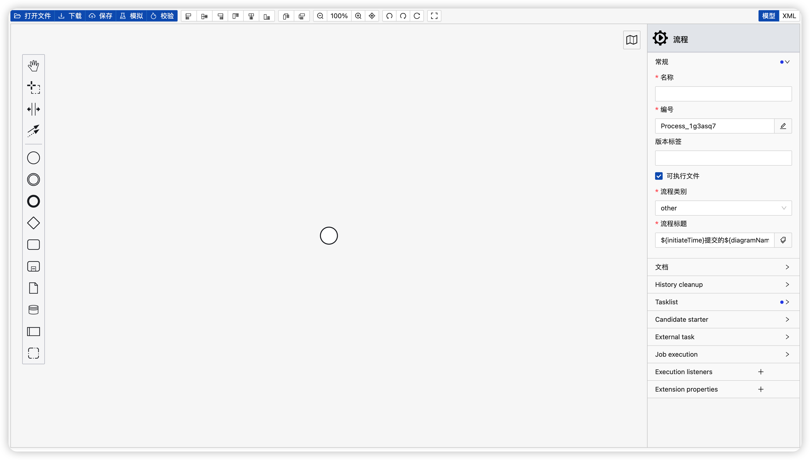

Skill Full Process Demo
===============
bpmn designer ,bpmn instance ,skill-cloud

当前最新版本： 1.1.0（发布日期：2022-08-19）

# 注意事项：
## 一、SkillFullBpmnDesigner需要引入一下依赖
```
  @import 'bpmn-js-color-picker/colors/color-picker.css';
  @import 'bpmn-js/dist/assets/bpmn-font/css/bpmn.css';
  @import 'bpmn-js/dist/assets/bpmn-font/css/bpmn-codes.css';
  @import 'bpmn-js/dist/assets/bpmn-font/css/bpmn-embedded.css';
  @import 'bpmn-js/dist/assets/bpmn-js.css';
  @import 'bpmn-js/dist/assets/diagram-js.css';
  @import 'bpmn-js-properties-panel/dist/assets/properties-panel.css';
  @import 'bpmn-js-token-simulation/assets/css/bpmn-js-token-simulation.css';
  @import 'diagram-js-minimap/assets/diagram-js-minimap.css';
  @import 'bpmn-js-bpmnlint/dist/assets/css/bpmn-js-bpmnlint.css';
```

## 二、SkillFullBpmnDiffer需要引入一下依赖
```
  @import 'bpmn-js/dist/assets/diagram-js.css';
  @import 'bpmn-js/dist/assets/bpmn-js.css';
```

## 三、SkillFullBpmnPreview需要引入一下依赖
```
  @import 'bpmn-js/dist/assets/bpmn-font/css/bpmn.css';
  @import 'bpmn-js/dist/assets/bpmn-font/css/bpmn-codes.css';
  @import 'bpmn-js/dist/assets/bpmn-font/css/bpmn-embedded.css';
  @import 'bpmn-js/dist/assets/bpmn-js.css';
  @import 'bpmn-js/dist/assets/diagram-js.css';
  @import 'diagram-js-minimap/assets/diagram-js-minimap.css';

```

## 四、SkillfullDmnDesigner需要引入一下依赖
```

```

## 五、SkillfullDmnPreview需要引入一下依赖
```

```

## 六、SkillfullInstancePreview需要引入一下依赖
```
  @import 'bpmn-js/dist/assets/bpmn-font/css/bpmn.css';
  @import 'bpmn-js/dist/assets/bpmn-font/css/bpmn-codes.css';
  @import 'bpmn-js/dist/assets/bpmn-font/css/bpmn-embedded.css';
  @import 'bpmn-js/dist/assets/bpmn-js.css';
  @import 'bpmn-js/dist/assets/diagram-js.css';
  @import 'diagram-js-minimap/assets/diagram-js-minimap.css';
```

## 七、SkillfullProcessHandle需要引入一下依赖
```

```

## 八、全局全部引入
```
```

# 使用教程
1. 建模器预览



2. 流程实例预览


3. 流程模型预览


说明
-----------------------------------

1. yarn install
2. npm run dev

Preview
-----------------------------------
[https://divisu.com](https://divisu.com/#/process/business/task-wait)
